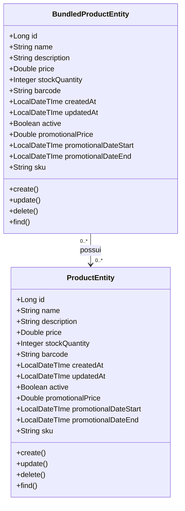

```mermaid

classDiagram
class BundledProductEntity {
+Long id
+String name
+String description
+Double price
+Integer stockQuantity
+String barcode
+LocalDateTIme createdAt
+LocalDateTIme updatedAt
+Boolean active
+Double promotionalPrice
+LocalDateTIme promotionalDateStart
+LocalDateTIme promotionalDateEnd
+String sku
+create()
+update()
+delete()
+find()
}

    class ProductEntity {
        +Long id
        +String name
        +String description
        +Double price
        +Integer stockQuantity
        +String barcode
        +LocalDateTIme createdAt
        +LocalDateTIme updatedAt
        +Boolean active
        +Double promotionalPrice
        +LocalDateTIme promotionalDateStart
        +LocalDateTIme promotionalDateEnd
        +String sku
        +create()
        +update()
        +delete()
        +find()
    }
    

    BundledProductEntity "0..*" --> "0..*" ProductEntity : possui

```