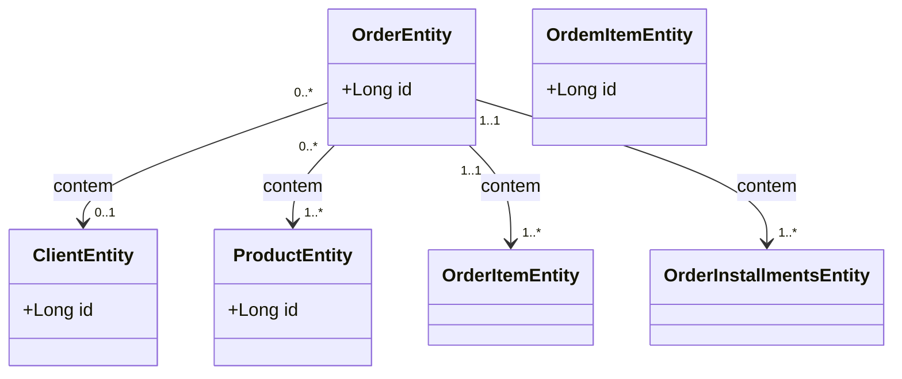

```mermaid

classDiagram
class OrderEntity {
+Long id

}

    class ClientEntity {
        +Long id
    
    }

    class ProductEntity {
        +Long id

    }

    class OrdemItemEntity {
        +Long id

    }

    OrderEntity "0..*" --> "0..1" ClientEntity : contem
    OrderEntity "0..*" --> "1..*" ProductEntity : contem
    OrderEntity "1..1" --> "1..*" OrderItemEntity : contem
    OrderEntity "1..1" --> "1..*" OrderInstallmentsEntity : contem
    
    

```