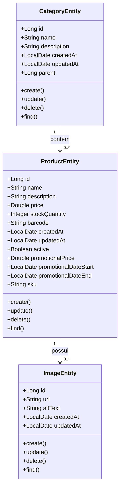

```mermaid

classDiagram
class ProductEntity {
+Long id
+String name
+String description
+Double price
+Integer stockQuantity
+String barcode
+LocalDate createdAt
+LocalDate updatedAt
+Boolean active
+Double promotionalPrice
+LocalDate promotionalDateStart
+LocalDate promotionalDateEnd
+String sku
+create()
+update()
+delete()
+find()
}

    class CategoryEntity {
        +Long id
        +String name
        +String description
        +LocalDate createdAt
        +LocalDate updatedAt
        +Long parent
        +create()
        +update()
        +delete()
        +find()
    }

    class ImageEntity {
        +Long id
        +String url
        +String altText
        +LocalDate createdAt
        +LocalDate updatedAt
        +create()
        +update()
        +delete()
        +find()
    }

    CategoryEntity "1" --> "0..*" ProductEntity : contém
    ProductEntity "1" --> "0..*" ImageEntity : possui

```