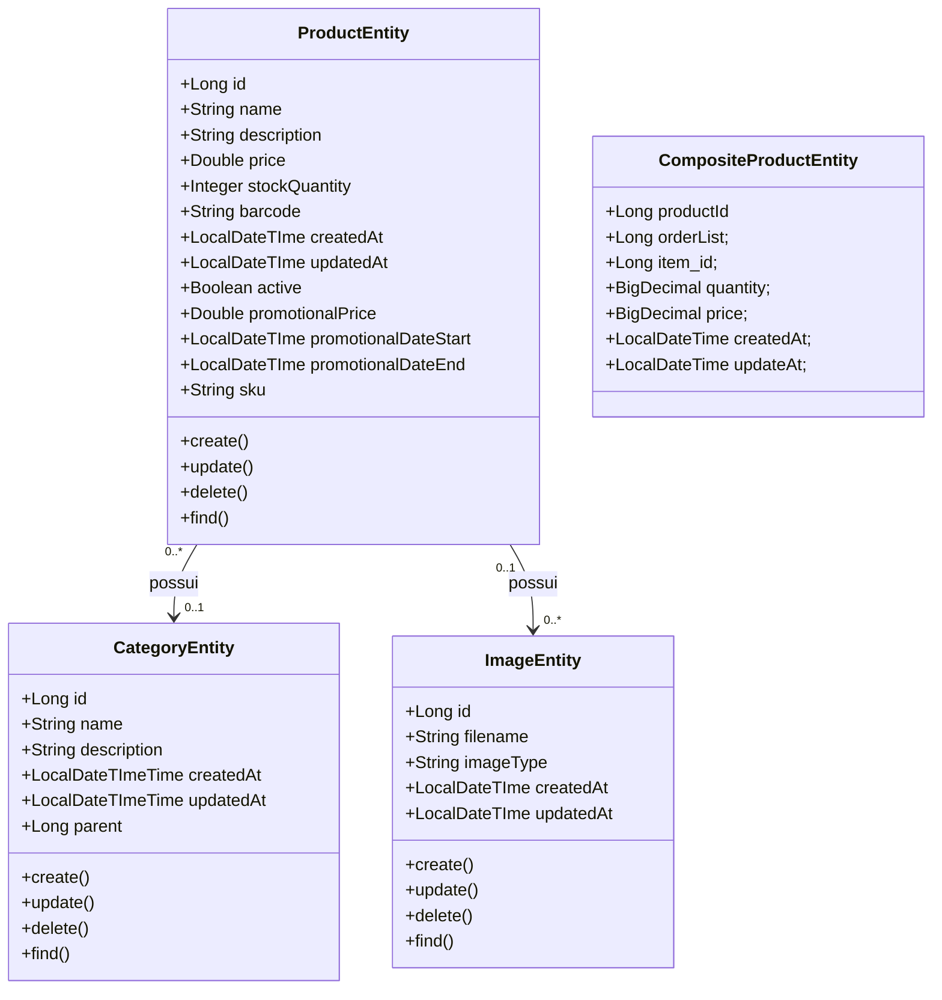

```mermaid

classDiagram
class ProductEntity {
+Long id
+String name
+String description
+Double price
+Integer stockQuantity
+String barcode
+LocalDateTIme createdAt
+LocalDateTIme updatedAt
+Boolean active
+Double promotionalPrice
+LocalDateTIme promotionalDateStart
+LocalDateTIme promotionalDateEnd
+String sku
+create()
+update()
+delete()
+find()
}

    class CategoryEntity {
        +Long id
        +String name
        +String description
        +LocalDateTImeTime createdAt
        +LocalDateTImeTime updatedAt
        +Long parent
        +create()
        +update()
        +delete()
        +find()
    }

    class ImageEntity {
        +Long id
        +String filename
        +String imageType
        +LocalDateTIme createdAt
        +LocalDateTIme updatedAt
        +create()
        +update()
        +delete()
        +find()
    }
    
    class CompositeProductEntity {
        +Long productId
        +Long orderList;
        +Long item_id;
        +BigDecimal quantity;
        +BigDecimal price;
        +LocalDateTime createdAt;
        +LocalDateTime updateAt;
    }

    ProductEntity "0..*" --> "0..1" CategoryEntity : possui
    ProductEntity "0..1" --> "0..*" ImageEntity : possui

```