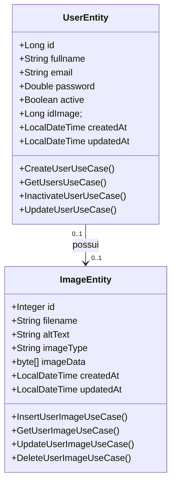

```mermaid

classDiagram
class UserEntity {
+Long id
+String fullname
+String email
+Double password
+Boolean active
+Long idImage;
+LocalDateTime createdAt
+LocalDateTime updatedAt
+CreateUserUseCase()
+GetUsersUseCase()
+InactivateUserUseCase()
+UpdateUserUseCase()
}

    class ImageEntity {
        +Integer id
        +String filename
        +String altText
        +String imageType
        +byte[] imageData
        +LocalDateTime createdAt
        +LocalDateTime updatedAt
        +InsertUserImageUseCase()
        +GetUserImageUseCase()
        +UpdateUserImageUseCase()
        +DeleteUserImageUseCase()
    }


    UserEntity "0..1" --> "0..1" ImageEntity : possui

```