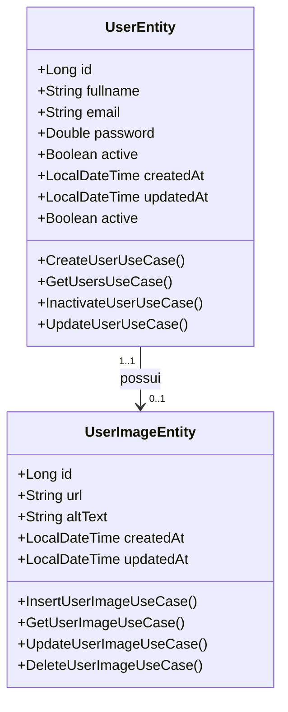

```mermaid

classDiagram
class UserEntity {
+Long id
+String fullname
+String email
+Double password
+Boolean active
+LocalDateTime createdAt
+LocalDateTime updatedAt
+Boolean active
+CreateUserUseCase()
+GetUsersUseCase()
+InactivateUserUseCase()
+UpdateUserUseCase()
}

    class UserImageEntity {
        +Long id
        +String url
        +String altText
        +LocalDateTime createdAt
        +LocalDateTime updatedAt
        +InsertUserImageUseCase()
        +GetUserImageUseCase()
        +UpdateUserImageUseCase()
        +DeleteUserImageUseCase()
    }


    UserEntity "1..1" --> "0..1" UserImageEntity : possui

```